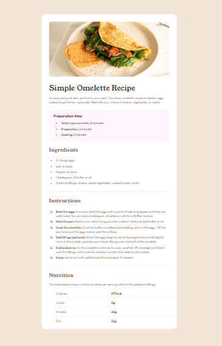

# Frontend Mentor - Recipe page solution

This is a solution to the **[Recipe page challenge on Frontend Mentor](https://www.frontendmentor.io/challenges/recipe-page-KiTsR8QQKm)** by
**[Dacardonac](https://github.com/Dacardonac)**. Frontend Mentor challenges help you improve your coding skills by building realistic projects.

## Table of contents
- [Frontend Mentor - Recipe page solution](#frontend-mentor---recipe-page-solution)
  - [Table of contents](#table-of-contents)
  - [Overview](#overview)
    - [Screenshot](#screenshot)
    - [Links](#links)
  - [My process](#my-process)
    - [Built with](#built-with)
    - [What I learned](#what-i-learned)
    - [Continued development](#continued-development)
    - [Useful resources](#useful-resources)
  - [Author](#author)
  - [Acknowledgments](#acknowledgments)

## Overview

### Screenshot



### Links

- Solution URL: **[Frontend Mentor Solution](https://www.frontendmentor.io/solutions/recipe-page-html-scss-c_63BXomXp)**
- Live Site URL: **[Production Deployment Vercel](https://fem-recipe-page-chi.vercel.app/)**

## My process

### Built with

- Semantic HTML5 Markup
- CSS3 Custom Properties
- [Sass/Scss](https://sass-lang.com/) - Modules
- Mobile-first Workflow
- [Vite](https://vitejs.dev/) - Frontend Tooling

### What I learned

I learned properties about the **Marker (::marker)** in ordered and unordered lists, worked with **BEM methodology** and with **modularized styles with sass**.

```html
  <ol class="article__list article__list--ordered">
    <li class="article__list-item">
      <span class="article__list-item--highlight">
        Beat the eggs:
      </span> In a bowl, beat the eggs with a pinch of salt and pepper until they are well mixed. You can add a tablespoon of water or milk for a fluffier texture.
    </li>
  </ol>
```
```css
    // Classes with BEM methodology

    &__list {
    padding: 0.625rem 1.5rem 0 2.813rem;

      &-item {
        $listItem: &;
        padding: 0.375rem 0.625rem 0 0.625rem;
        line-height: 1.188rem;
        color: var(--stone-600);
      }

      &--ordered {
        & #{$listItem}::marker {
          font-size: 0.813rem;
          font-weight: 700;
        }
      }
    }
```

### Continued development

I want to continue learning more about BEM methodology and perfect the technique in aspects like name the classes, also I want to improve in modularize the component's styles with Sass and learn about Conventional Commits

### Useful resources

- **[MDN](https://developer.mozilla.org/en-US/)** - This helped me with **Documentation** on many topics, mostly with **HTML** and **CSS** properties.
- **[ChatGPT](https://chatgpt.com/)** - This is an incredible **Artificial Intelligence (AI)** tool, **ChatGPT** helps me with **specific topics**, **errors in the project** and **investigations**.

## Author

- Frontend Mentor - **[@Dacardonac](https://www.frontendmentor.io/profile/Dacardonac)**
- LinkedIn - **[@Daniel Alejandro Cano Cardona](https://www.linkedin.com/in/daniel-alejandro-cano-cardona/)**


## Acknowledgments

I want to thank **[Jairovg](https://github.com/jairovg)** for the teachings and his help to complete this challenge in a good way and with good practices.